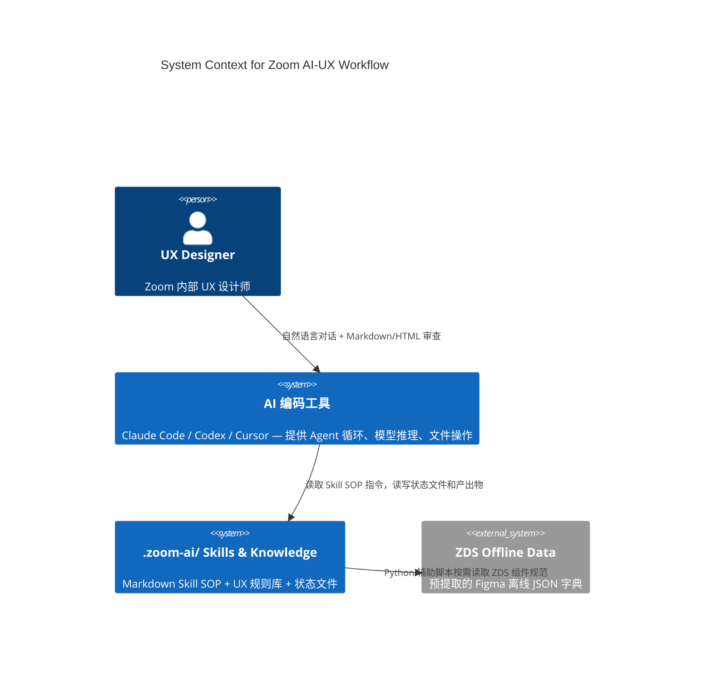
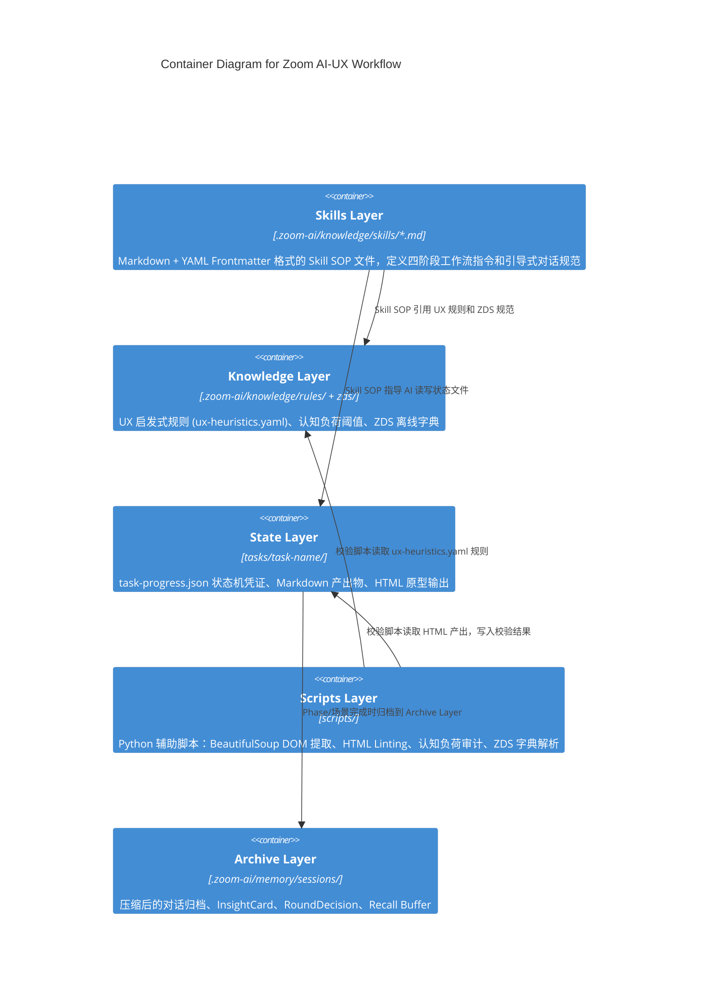
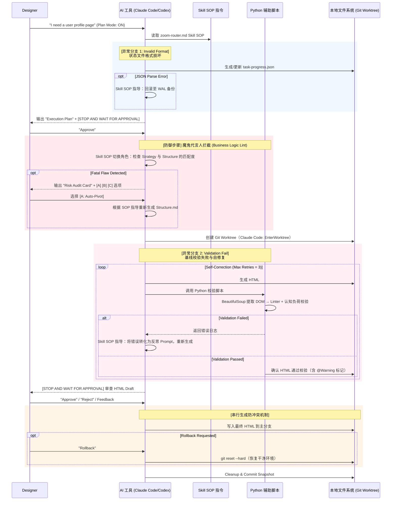

# Zoom AI-UX Workflow - 技术架构说明书 (V0.2 Skill 架构)

## 目录

1. [业务上下文与关键用例](#1-业务上下文与关键用例)
2. [总体架构设计 (C4 模型)](#2-总体架构设计-c4-模型)
3. [技术选型与技术栈清单](#3-技术选型与技术栈清单)
4. [核心模块职责与接口定义](#4-核心模块职责与接口定义)
5. [数据模型与存储方案](#5-数据模型与存储方案)
6. [宿主 AI 工具适配层](#6-宿主-ai-工具适配层)
7. [安全与合规设计](#7-安全与合规设计)
8. [性能目标与容量规划](#8-性能目标与容量规划)
9. [部署与运维方案](#9-部署与运维方案)
10. [风险评估与回滚预案](#10-风险评估与回滚预案)
11. [MVP与可验证标准](#11-mvp与可验证标准)

---

## 1. 业务上下文与关键用例

**系统定位**：Zoom AI-UX Workflow 是一套**嵌入式 Skill + Knowledge 目录**，运行在设计师日常使用的 AI 编码工具（Claude Code、Codex、Cursor）内部。AI 工具本身就是编排引擎——无需独立的 Python 应用或自建路由器。系统通过结构化的 Skill SOP 文件（Markdown + YAML Frontmatter）引导 AI 工具按照四阶段工作流执行，将设计师的"PRD 输入"转化为"高保真可交互 HTML 原型"。

**核心价值**：解决设计师空间直觉与 AI 线性逻辑的鸿沟，通过"人类绝对控制 + 机器自动验收"的双轨机制，实现生产级高保真原型的快速推演。

**唯一目标用户：Zoom 内部 UX 设计师**。设计师全天候在 AI 编码工具中工作，习惯使用 Markdown 梳理逻辑、HTML/CSS 预览原型。**核心 UX 红线：绝不要求设计师审查 HTML 代码或解决 Git merge conflict。** 设计师的 Human-in-the-loop 只集中在"逻辑层"（审查 Markdown + 引导式对话）和"视觉层"（预览 HTML 原型）。

**核心用户旅程**：

```
Phase 1: 上下文对齐 → Phase 2: 调研+JTBD → Phase 3: 逐场景交互方案(含黑白线框) → Phase 4: 高保真 HTML
```

**关键用例 (Key Use Cases)**：

1. **产品上下文知识库 Onboarding (Product Context Bootstrapping)** ← **V0.3 新增**：首次启用时引导用户描述行业/产品（3-5 个问题），通过 Web Search 自动生成本地知识库（5 个 L1 Markdown 文件 + L0 索引）。知识库在后续 task 中通过 Phase 2 增量补充和 task 完成学习持续增长。L0 索引常驻锚定层（~500-800 tokens），L1 详情按 Phase 需求按需加载。
2. **引导式对话与多阶段人类审批 (Guided Dialogue & Multi-gate Approval)**：AI 作为**共创伙伴 (Co-creation Partner)** 主动提问、呈现选择空间、与设计师共同探索边缘场景。语言模式强调 trade-off 呈现而非推荐式建议，避免权威梯度导致的过早收敛。Skill SOP 在 8+ 个关键节点设置 `[STOP AND WAIT FOR APPROVAL]` 控制点（Onboarding 确认、上下文对齐确认、知识库增量确认、JTBD 收敛确认、场景列表确认、每场景方案选择、最终 Review、归档确认+知识学习），设计师手动确认后才允许流转。
3. **混合调研能力 (Hybrid Research)**：AI 在 Phase 2 **先读取知识库已有内容避免重复调研**，再执行增量市场/竞品/用户调研（Web Search + AI 工具内置知识 + 设计师上传材料），产出结构化调研报告，并将发现与 task 的 flow/feature 关联。**调研中发现知识库外的新洞察时，提议增量更新知识库（需设计师确认）。**
3. **逐场景交互方案探索与黑白原型 (Per-scenario Exploration & Wireframe Prototyping)**：Phase 3 中 AI 动态拆分交互场景，逐场景生成 1-2 个交互方案及对应的黑白 HTML 线框原型（AI 根据场景复杂度和前序讨论上下文自主判断方案数量），每次方案展示附带轻量级"未探索替代范式"标注（Pull 模式，~50 tokens），设计师体验原型后选择或提供新方向。
4. **两阶段 HTML 生成 (Two-tier HTML Generation)**：先生成黑白线框原型（灰度 + 简单边框，专注布局和交互流程），全部场景确认后再生成完整高保真可交互 HTML（Tailwind CSS + 导航 + JS 交互）。
5. **任务边界上下文压缩 (Task-boundary Context Compression)**：Skill SOP 在每个 Phase/场景完成时指导 AI 主动归档对话过程，只保留结构化产出物和摘要索引。
6. **Git Worktree 安全隔离 (Branch Isolation)**：利用宿主 AI 工具原生的 Worktree 能力（如 Claude Code 的 `EnterWorktree`）为并行任务创建隔离沙箱。Git 仅用于快照和回滚，不参与冲突处理。
7. **Figma 规范精准挂载 (Local Dict Retrieval，延后)**：Python 辅助脚本按需解析 ZDS 组件规范（< 2ms）。此功能延后至 ZDS JSON 提取完成后启用，MVP 阶段使用 Tailwind CSS。

### 1.1 交互载体矩阵 (Interface Surfaces)

本项目没有独立的前端页面。**AI 工具就是界面，文件就是状态，对话就是交互。** 工程实现需支撑以下交互面：

| #   | 交互载体                          | 职责                                          | 工程支撑要求                                |
| --- | ----------------------------- | ------------------------------------------- | ------------------------------------- |
| 1   | **Skill 命令** (`/zoom-design`) | 触发工作流启动、阶段跳转、归档回引 | Skill SOP 文件 + `task-progress.json` 状态驱动 |
| 2   | **Chat Panel** (AI 工具聊天面板)  | 自然语言输入、Plan Mode 开关、异常报告                    | Skill SOP 指导 AI 执行 `[STOP AND WAIT FOR APPROVAL]` 中断 |
| 3   | **File Explorer** (IDE 资源管理器) | 展示 `task-progress.json`、Markdown 文件、HTML 产出 | Git Worktree 对主目录透明 |
| 4   | **Live Preview** (内嵌/外部浏览器)   | 实时渲染高保真 HTML，设计师在此视觉审查                      | Python 辅助脚本 Pass@1 通过后才暴露给设计师 |
| 5   | **Markdown Logic Review**     | 审查 `@Warning` 批注、把控逻辑走向、执行 Approve          | Skill SOP 在 Approve 后指导 AI 闭环修补 HTML |

---

## 2. 总体架构设计 (C4 模型)

### 2.1 C4 Context (系统上下文图)



> **关键变更**：移除了独立的"LLM Gateway"——AI 工具自身提供模型推理能力，无需额外的 LLM 调用网关。设计师不配置 LLM，直接使用宿主 AI 工具内置模型。

### 2.2 C4 Container (容器级架构图)



> **关键变更**：移除了 Central Router Engine、Middleware Pipeline、Dynamic Skills Loader 等 Python 容器。AI 工具的 Agent 循环直接读取 Skill SOP 文件并执行指令，不需要自建编排引擎。

---

## 3. 技术选型与技术栈清单

| 领域 | 选型 | 被淘汰方案 | 理由 |
|------|------|----------|------|
| **编排引擎** | 宿主 AI 工具 Agent 循环 | LangGraph, AutoGen, CrewAI | 零基础设施，直接复用宿主模型和 Agent 循环 |
| **技能定义** | Markdown + YAML Frontmatter (SKILL.md) | Python 硬编码 | 设计师可直接编辑，对齐 Claude Code / Codex 原生格式 |
| **状态管理** | JSON 文件 (task-progress.json) | SQLite, LangGraph Checkpointer | 透明可见，可人工查看和编辑，AI 工具直接读写 |
| **确定性校验** | Python 辅助脚本 (scripts/) | 无 | BeautifulSoup DOM 提取、HTML Linter、认知负荷校验——这些需要确定性代码，不适合交给 LLM |
| **上下文管理** | Skill SOP 结构化指令 | tiktoken + ContextGuard | 宿主工具管理上下文窗口；Skill SOP 指令在自然完成点主动触发归档和压缩 |
| **版本控制** | Git Worktree (宿主工具原生) | 自建 Git 管理 | Claude Code `EnterWorktree`、Codex 内置沙箱 |
| **ZDS 规范挂载** | Python 辅助脚本 (本地 JSON 解析) | Node.js / MCP | 纯 Python 内存反序列化，2ms 响应，零跨语言依赖 |

---

## 4. 核心模块职责与接口定义

### 4.1 核心模块：Skill 编排与状态流转

- **编排机制**：主编排 Skill（`zoom-router.md`）包含四阶段调度逻辑，以 SOP 指令形式表达。AI 工具读取 Skill 文件后，按照 SOP 步骤执行——每个步骤包含明确的前置条件、执行指令、预期输出和后续跳转逻辑。
- **状态流转（含 Onboarding）**：

```
[onboarding_check] → (知识库不存在?) → onboarding → init → alignment → research_jtbd → [research_evaluator] → [STOP: JTBD确认(含评估报告)] → interaction_design → [logic_inquisitor] → [prepare_design_contract] → [contract_evaluator] → [STOP: contract_review(含评估报告)] → hifi_generation → [baseline_validation] → [prototype_evaluator] → [STOP: review(含评估报告)] → [knowledge_extraction] → complete
                   → (知识库已存在?) ─────────────→ init                  |                                                                                                                                                                                              |
                                                                          └─── 场景循环（Skill SOP 内嵌循环指令）                                                                                                                                                └─── 自修复循环 (max 3)
```

> **V0.4 变更**：新增 3 个独立评估节点（`[research_evaluator]`、`[contract_evaluator]`、`[prototype_evaluator]`），每个均在独立 session（Context Reset）中运行。`[contract_evaluator]` 替代原有的 `[validate_contract]` 自检。详见 §4.5 独立评估层。

状态机逻辑不再由 Python 代码实现，而是通过 Skill SOP 的条件跳转指令表达。AI 工具读取 `task-progress.json` 中的当前状态，对照 Skill SOP 执行下一步操作。

- **Onboarding 前置检查**：`zoom-router.md` 在 `init` 前插入检查——若 `.zoom-ai/knowledge/product-context/product-context-index.md` 不存在，触发 `onboarding-skill.md`，引导用户描述行业/产品，通过 Web Search 自动生成本地知识库。此步骤仅在首次使用时执行。

- **Knowledge Extraction 后置步骤**：在 `review → complete` 之间插入 `knowledge_extraction` 步骤——从 task 所有产出物中全维度提取可复用知识（产品约束、用户洞察、设计模式、竞品发现），逐条展示给设计师确认后追加到知识库 L1 文件。

- **Phase 2 内部阶段结构 (Context Reset Architecture)**：Phase 2 内部有四个语义阶段。Stage C 发散讨论采用**话题级 Context Reset**——Skill SOP 指导 AI 在话题切换时主动归档当前话题讨论到 `phase2-topic-{domain}-{n}.md`，用结构化交接文件（InsightCard）启动新对话回合，确保模型质量不随对话长度退化：

  ```
  [Stage A] 调研执行 ──→ [Stage B] 调研呈现与关联 ──→ [Stage C] 发散讨论 ──→ [Stage D] JTBD 收敛
      AI 并行调研               生成 00-research.md         每个话题域独立对话回合     设计师确认可收敛
      (Web Search +              摘要展示给设计师             话题切换 = Context Reset   → 生成 01-jtbd.md
       AI 内置知识 +             关联到 task flow            InsightCard = 交接文件
       设计师材料)               → Stage B→C 转换时           工作层恒定 12-17k tokens
                                  报告降级为摘要版
  ```

  - **Stage B→C 转换**：Skill SOP 指导 AI 将工作层中的 `00-research.md` 从完整版降级为 ToC + 关键数据点摘要（~2-3k tokens），完整版归档到 `phase2-research-full.md`。降级后的摘要版作为每个话题回合的固定输入之一
  - **Stage C 话题级 Context Reset**：每个话题域是独立的对话回合。Skill SOP 指示 AI 在话题切换时：提取 InsightCard → 归档话题完整对话到 `phase2-topic-{domain}-{n}.md` → 用交接文件（所有 InsightCards + 调研摘要）启动新对话回合。每个话题回合的工作层峰值恒定在 12-17k tokens
  - **Stage C→D 转换**：最后一个话题的 InsightCard 提取后，Skill SOP 指导 AI 执行最后一次 Context Reset，启动 Stage D 回合（输入 = 所有 InsightCards + 调研摘要 ≈ 12-15k tokens）

- **Phase 3 嵌套状态**：Phase 3 的场景循环由 Skill SOP 的循环指令驱动。外层循环遍历场景列表，内层循环处理每个场景的方案探索（1-2 方案 + 设计师选择 + 可能的重新发散）。**场景完成时，Skill SOP 指导 AI 将该场景的 `RoundDecision` 卡片随场景对话一并归档到 `phase3-scenario-{n}.md`，从工作层移除**，仅在摘要索引中保留语义标签。Design Contract 阶段会从归档中重新提取所需信息，不依赖工作层中的 RoundDecision。

- **Phase 3→4 过渡层：Design Contract 机制 (Anti-Context-Starvation)**：

  > **问题**：Phase 3 的场景级压缩（每场景 ~200 tokens 摘要）导致 Phase 4 丢失跨场景导航拓扑、具体交互承诺和全局设计约束——即"上下文饥饿"，压缩过度的反方向问题。

  在 Phase 3 全部完成后、Phase 4 启动前，Skill SOP 插入两个步骤：

  **`prepare_design_contract` 步骤**：
  1. **并发场景提取**：Skill SOP 指导 AI 对每个场景，从归档文件（`phase3-scenario-{n}.md` + 所有 `phase3-scenario-{n}-round-{m}.md` Recall Buffer）中，提取结构化 `ScenarioContract`。N 个场景可利用 AI 工具的并行 Agent 能力并发执行（每个场景独立，符合 Assembler Pattern 原则）。
  2. **全局合约合成**：输入所有 `ScenarioContract` + `02-structure.md` + 锚定层 `confirmed_intent`，由 AI 合成为完整的 `DesignContract`。
  3. **物化**：写入 `03-design-contract.md`（Markdown 格式，设计师可在 IDE 中编辑），同时注入 Phase 4 工作层。
  4. **摘要索引回填 (Index Backfill)**：从所有 `ScenarioContract` 中提取 `shared_state` 和 `dependency` 语义标签，回填到摘要索引中已有的场景条目。此步骤补全了场景完成时无法确定性提取的跨场景维度标签（`[状态:xxx]` 和 `[依赖:→场景N]`），使摘要索引具备完整的 recall 触发能力。

  **`contract_evaluator` 步骤（V0.4 — 替代原 `validate_contract` 自检）**：

  > **V0.4 架构变更**：将合约校验从"同一 Agent 自检"升级为**独立 session（Context Reset）评估**。原有的 `validate_contract` 存在 confirmation bias——合约生成者倾向于认为自己的合约完备。独立 Evaluator 没有"我生成了这份合约"的上下文记忆，能更客观地发现缺口。

  1. **Context Reset 隔离**：Contract Evaluator Skill 在独立 session 中运行。输入仅为 `03-design-contract.md` + `confirmed_intent` + 知识库 L0。**不带** Phase 3 的场景讨论历史和 `prepare_design_contract` 的生成过程。
  2. **5 维度评估**：
     - **导航完备性 (Navigation Completeness)**：所有场景出口是否都有对应入口？是否存在死胡同？
     - **状态一致性 (State Consistency)**：shared_state 的 produced_by / consumed_by 是否完整？是否有未声明的隐式状态依赖？
     - **承诺忠实度 (Commitment Fidelity)**：抽查 2-3 个场景，从归档中回引该场景最后一轮 RoundDecision，检查 interaction_commitments 是否遗漏。**这是独立 Evaluator 的核心优势**——自检 Agent 倾向于"我生成的肯定没遗漏"，独立评估者无此偏见。
     - **约束矛盾 (Constraint Conflicts)**：跨场景约束是否存在逻辑矛盾？
     - **可生成性 (Generatability)**：作为 Phase 4 输入，Contract 是否足够具体？哪些地方模糊？
  3. **对抗激励**：强制输出至少 1 个完备性缺口 + 1 个承诺忠实度风险点。
  4. 发现缺口时自动补充到 Contract 并标记 `[auto-补充]`。
  5. 输出结构化评估卡片（每维度打分 1-5 + 证据 + 改进建议）。

  **`contract_review` 中断点（`[STOP AND WAIT FOR APPROVAL]`）**：
  - Skill SOP 指示 AI 暂停执行，等待设计师在 IDE 中 Review/编辑 `03-design-contract.md`
  - **V0.4 增强**：同时呈现 Contract Evaluator 的结构化评估报告
  - 设计师可补充遗漏的交互细节、修改导航拓扑、调整全局约束
  - 特别关注 `[auto-补充]` 标记的内容和评估报告标记的风险点
  - 设计师 Approve 后 AI 继续执行，进入 `hifi_generation`

  **数据模型**：

  ```yaml
  # ExitAction 结构
  target_scenario: "场景2-会中协作"    # 目标场景 ID
  trigger: "点击'完成'按钮"             # 触发条件
  shared_state_changes:                # 出口时修改的共享状态
    - "meeting_status → completed"

  # ScenarioContract 结构（单场景的 Phase 4 设计合约）
  scenario_id: "scenario-1"
  scenario_name: "会前准备"
  selected_option_summary: "时间线视图，支持拖拽排序议程项"  # ~100 tokens
  # 导航拓扑
  entry_conditions:                    # 从哪些场景/状态可以进入
    - "从仪表盘主页点击会议卡片"
    - "从日历视图点击会议条目"
  exit_actions:                        # 完成后的跳转目标与触发条件
    - target_scenario: "场景2-会中协作"
      trigger: "点击'开始会议'按钮"
      shared_state_changes:
        - "meeting_status → in_progress"
  shared_state_dependencies:           # 依赖的跨场景共享状态
    - "current_user"
    - "selected_meeting"
  # 交互承诺
  interaction_commitments:             # 最多 5 条：讨论中达成的具体交互决策
    - "议程项支持拖拽排序"
    - "空状态使用插画+引导文案"
  # 全局约束
  global_constraints:                  # 跨场景适用的约束
    - "首屏不超过 5 个模块"
    - "支持零引导上手"
  # 边缘态
  edge_cases_to_handle:               # 讨论中明确要处理的边缘情况
    - "会议被取消时的状态恢复"
    - "无议程项时的空状态"

  # SharedState 结构（跨场景共享的状态变量）
  name: "current_user"                 # 如 "current_user", "selected_meeting"
  type: "object"                       # 如 "object", "boolean", "string"
  produced_by:                         # 哪些场景写入
    - "场景0-登录"
  consumed_by:                         # 哪些场景读取
    - "场景1-会前准备"
    - "场景2-会中协作"

  # NavigationMap 结构（场景间的完整导航图）
  entry_point: "场景1-会前准备"           # 默认入口场景
  adjacency:                           # 场景 ID → 可直接跳转的目标场景列表
    场景1-会前准备: ["场景2-会中协作"]
    场景2-会中协作: ["场景3-会后总结", "场景1-会前准备"]

  # DesignContract 结构（Phase 4 高保真生成的完整设计合约）
  navigation_topology:                 # NavigationMap
    entry_point: "场景1-会前准备"
    adjacency: { ... }
  shared_state_model:                  # list[SharedState]
    - name: "current_user"
      type: "object"
      produced_by: ["场景0-登录"]
      consumed_by: ["场景1-会前准备", "场景2-会中协作"]
  global_constraints:                  # 去重合并后的全局约束
    - "首屏不超过 5 个模块"
    - "支持零引导上手"
  visual_consistency_rules:            # 从约束推导的视觉一致性规则
    - "所有场景使用统一的侧边栏导航"
    - "按钮圆角统一 8px"
  scenarios:                           # list[ScenarioContract]
    - scenario_id: "scenario-1"
      scenario_name: "会前准备"
      # ... (完整 ScenarioContract 结构)
  ```

  **Token 预算影响**：
  - 提取开销：N 个场景并发提取（每个 ~2-5k input + ~500 output）+ 1 次合成 + 1 次校验 ≈ 额外 2-3 次 AI 调用
  - Phase 4 进入时上下文：锚定层 ~5-6k（含语义标签索引） + DesignContract ~3-5k + 生成指令 ~2k ≈ **10-13k tokens**（生成空间充裕）
  - 与统一 `recall` 机制互补（详见 §4.2）：Phase 4 执行中遇到 Contract 未覆盖的极端细节时，仍可按需从归档中回引

- **并行 Agent 与状态外化机制**：Skill SOP 指导 AI 工具利用原生并行 Agent 能力（如 Claude Code 的子 Agent）执行可并行的子任务。状态外化为 `task-progress.json`（纯机器读写的状态清单）。子 Agent 在循环中必须先读取 JSON 恢复现场。
  - **State 隔离机制**：Skill SOP 明确要求在调度子任务时，**严禁将上一轮的脏对话传递给子 Agent**。只将原始 Intent 和 JSON 中的当前子任务状态传递。子 Agent 跑完只回传摘要。
- **渐进式技能加载**：AI 工具启动时仅读取 Skill 文件的 YAML Frontmatter（name + description），按需加载完整 SOP 正文。
- **状态机控制规范 (Dual-level Control & Interrupts)**：
  1. **显式中断 (Human-in-the-loop)**：Skill SOP 在宏观流转节点设置 `[STOP AND WAIT FOR APPROVAL]` 指令。AI 工具暂停执行，等待设计师确认。严禁全自动闭环修改。
  2. **语义合并机制 (Prompt Merging)**：若用户给出修改意见，Skill SOP 严禁 AI 直接重试，必须将原始 `user_intent` 与 `feedback` 结构化合并，确保修改意见被精准注入而非被旧上下文稀释。
  3. **基于 Git 的版本快照与大退回 (Snapshot & Rollback)**：Git Worktree 和 Branch 仅用于里程碑的"只读快照"保存。当设计师要求回退时，恢复干净环境。
  4. **严禁同文件并发与组装器模式 (Strict Serialization & Component Assembler)**：彻底否决多个 Agent 并发修改同一文件。并发必须被限制在相互独立的子模块级（生成 `header.html`, `sidebar.html`），随后由 Python 辅助脚本（DOM Assembler）将其拼接为主页面。绝不允许将合并工作抛给不可控的 `git merge`。
  5. **非对称红蓝对抗 (Logic Inquisitor)**：Skill SOP 在 `Strategy.md` 与 `Structure.md` 生成后，强制插入"魔鬼代言人"步骤。**关键增强：Logic Inquisitor 在独立 session 中运行**（Fresh Session 隔离），输入仅为 `Strategy.md` + `Structure.md` + `confirmed_intent`，不带生成过程的对话历史，打破 confirmation bias。Skill SOP 加入对抗性激励（强制最低输出 2 Warning + 1 Issue，失职问责激励）。在 LLM 审查之前，Python 辅助脚本先执行确定性完备性检查（empty state 覆盖、error 行为覆盖、scenario ID 交叉引用）。若发现致命漏洞阻断流程，则输出 `[A]接受削减 [B]补充上下文 [C]强制覆盖` 的结构化卡片。
  8. **独立评估层 (Independent Evaluator Layer)** ← **V0.4 新增**：将 Logic Inquisitor 的"分离审查"模式扩展到 Phase 2/3→4/4 的三个关键产出节点。每个 Evaluator 在独立 session（Context Reset）中运行，使用结构化评分维度和对抗性激励。详见 §4.5。
  6. **自动化基线与举证拦截 (Baseline & Evidence Guardrail)**：在 UI 渲染呈现给设计师之前，Skill SOP 指导 AI 调用 Python 辅助脚本执行**两道机器审查**：
    - **举证校验**：校验是否引用了 ZDS 组件规范。
    - **反向提取与轻量级校验**：Python 脚本使用 `BeautifulSoup` 从 HTML 中**反向提取**真实 DOM 树（AST），并基于该真实树运行 Linter 和 `ux-heuristics.yaml` (认知负荷) 校验。只有 Pass@1 验证通过的产出才允许触发 `[STOP AND WAIT FOR APPROVAL]` 中断。
  7. **@Warning 批注与 DOM 补丁闭环**：当 AI 在 Markdown 草稿中插入 `@Warning` 批注并被设计师 Approve 采纳后，Skill SOP 指导 AI 输出明确的 DOM 操作指令（如 `{"action": "remove", "node_id": "btn-123"}`），由 Python Assembler 脚本在反向提取的真实 DOM 树上执行结构化手术，再重新序列化为 HTML，彻底抹杀 HTML 结构被破坏的风险。

### 4.2 归档回引机制 (Recall Tool Family)

为解决归档层"只出不进"的单向通道问题，Skill SOP 定义了统一的 `recall` 操作规范，覆盖所有 Phase 的归档文件，支持 4 级粒度，受严格的 Token 预算保护。

**Recall 接口规范**：

```yaml
# RecallTarget 结构（回引目标定位）
phase: "phase3"                        # phase1 | phase2 | phase3 | phase4
scenario_id: "scenario-1"              # Phase 3 专用
round_number: 2                        # 轮次级回引（可选）

# RecallGranularity 粒度级别
# excerpt  — 精准段落提取 (~100-500 tokens)
# section  — 章节级提取 (~500-2k tokens)，默认
# round    — 完整 Round (~3-8k tokens)
# full     — 完整归档文件 (受硬上限 15k 截断)

# RecallResult 结构（回引结果）
content: "..."                         # 回引的内容
source_path: ".zoom-ai/memory/sessions/phase3-scenario-1.md"
token_count: 1500
granularity: "section"
was_truncated: false
truncation_reason: null                # 被截断时的原因
```

**回引路径解析规则**（Skill SOP 内嵌）：
- phase1 → `phase1-alignment.md`
- phase2 → `phase2-research.md`（调研报告摘要/完整版）
- phase2 + topic_domain → `phase2-topic-{domain}-{n}.md`（话题级 Recall Buffer）
- phase2 + "research_full" → `phase2-research-full.md`（调研报告完整版归档）
- phase3 + scenario_id → `phase3-scenario-{id}.md`（含该场景所有 RoundDecision 卡片）
- phase3 + scenario_id + round_number → `phase3-scenario-{id}-round-{round}.md`
- phase4 + round_number → `phase4-review-round-{round}.md`

**粒度自动升级**：若关键词评分为 0（未命中），Skill SOP 指导 AI 自动升级到下一粒度。

**检索实现（excerpt/section 粒度）**：Skill SOP 指导 AI 使用确定性关键词检索（不使用额外 LLM 调用）：
- `excerpt` 粒度：按段落切分（空行分隔），BM25-like 关键词评分，返回 top-3 段落
- `section` 粒度：按 Markdown H2/H3 标题切分，返回标题最匹配的章节

**RecallBudget 预算参数**：

```yaml
# Recall 预算限制（嵌入 Skill SOP 作为硬约束）
single_recall_soft_limit: 5000         # 单次回引软上限 tokens
single_recall_hard_limit: 15000        # full 粒度硬上限 tokens
session_recall_budget: 30000           # 单次 AI 调用总预算 tokens
working_layer_ceiling: 80000           # 工作层绝对上限（200k 的 40%）
```

**预算检查逻辑**（Skill SOP 指令形式）：
1. 绝对上限：若 anchor + working + ephemeral + requested > `working_layer_ceiling`(80k)，则拒绝或截断
2. 单次上限：full 粒度受 `single_recall_hard_limit`(15k) 限制，其他粒度受 `single_recall_soft_limit`(5k) 限制
3. 会话总预算：活跃回引内容 + 新请求不得超过 `session_recall_budget`(30k)

**循环回引自动升级**：Skill SOP 规定同一目标回引 3 次后，AI 应将其升级为工作层常驻内容。

**工作层水位监控 (WorkingLayerWaterLevel)**：

为填补工作层 20k 软预算与全局 170k 安全网之间的防御真空带，Skill SOP 定义全局工作层水位监控。模型注意力衰减在工作层 30-50k 时就已显著影响生成质量，远早于 170k 安全网触发。

```yaml
# 水位区间定义
green: "0-25k tokens"                  # 正常运行
yellow: "25-40k tokens"                # Advisory — 内部预警，加速已有压缩
orange: "40-60k tokens"                # Active — 主动压缩（最老 50% 对话 → 中间摘要）
red: "60k+ tokens"                     # Critical — 强制深度压缩（等同 L2 策略）

# Phase 专属软预算
# Phase 2: 已被 Context Reset 机制取代（每个话题 session 峰值 ≈ 12-17k tokens）
phase3_soft_budget: 20000              # Phase 3 Round 级
```

**水位层级关系**：
```
Phase 2 话题级 Context Reset ── Phase 2 专属（每个话题独立回合，工作层恒定 12-17k，无需软预算）
Phase 3 Round 软预算 20k ───┐
                             ├── 工作层水位监控（主动，Phase-agnostic）
全局水位 Advisory 25k ───────┤
全局水位 Active 40k ─────────┤── 全局通用（管所有 Phase 的整体膨胀）
全局水位 Critical 60k ───────┘
RecallBudget Ceiling 80k ──── 回引专属（管 ephemeral 注入）
L2 深度摘要 170k ──────────── 全局安全网（被动兜底）
L3 紧急熔断 190k ──────────── 全局安全网（最后防线）
```

### 4.3 时序图：Skill 驱动的安全生成链路（含异常兜底）



### 4.4 异常分支与机器自动兜底策略 (Auto-Fallback Strategies)

为保证工作流的鲁棒性，Skill SOP 在核心流转节点强制引入以下兜底策略：

1. **Invalid Format 兜底 (状态防写坏机制)**：
  - **问题场景**：AI 输出带有 Markdown 标记的伪 JSON 或结构截断，导致 `task-progress.json` 无法解析。
  - **Skill SOP 兜底策略**：SOP 指导 AI 在每次更新状态文件前自动备份当前合法版本（WAL 写前备份）。若新写入无法解析，SOP 指导 AI 尝试正则清洗；若清洗仍失败，回滚至上一个 WAL 安全备份，不阻断主线程。

2. **Validation Fail 兜底 (剥夺 AST 生成权与自修复循环)**：
  - **问题场景**：AI 如果同时生成 HTML 和 AST 会导致"双写幻觉"——两者逻辑不一致。
  - **Skill SOP 兜底策略**：
    - **剥夺权力**：SOP 明确规定 AI 仅负责生成 HTML，严禁输出 UI_AST。
    - **确定性反向解析**：SOP 指导 AI 调用 Python 辅助脚本（BeautifulSoup）反向提取真实 DOM 树，用作认知负荷校验。
    - **重试闭环**：SOP 规定 Max_Retries = 3 的 Self-Correction 机制。校验失败时，SOP 指导 AI 将错误转化为反思 Prompt 重新生成。仅当连续 3 次失败后，才向设计师输出可读的异常报告。

3. **并发灾难防范 (Assembler Pattern)**：
  - **问题场景**：多 Agent 并发修改同一文件时，Git 合并高频触发冲突。
  - **Skill SOP 兜底策略**：SOP 在架构级**物理禁止同文件并发**。并发必须被限制在相互独立的子模块级。最后由 Python 辅助脚本（DOM Assembler）将其合并为完整的页面树。

4. **业务逻辑崩塌防范 (Logic Inquisitor Auto-Pivot)**：
  - **问题场景**：AI 为了快速完成任务，生成的 Structure 严重偏离 Strategy 的原始意图。单 Agent 自我审查存在 confirmation bias（同一模型生成又审查，盲区共享）。
  - **Skill SOP 兜底策略**：SOP 引入三层防御——①**确定性完备性前置检查**（Python 脚本验证 empty state、error 行为、ID 交叉引用等覆盖度），②**Fresh Session 隔离**（Logic Inquisitor 在独立 session 中运行，输入仅为文档文本，不带生成历史），③**对抗性激励**（强制最低输出 2 Warning + 1 Issue + 失职问责）。若发现致命逻辑断层，SOP 指导 AI 挂起流程并弹出结构化选项。若用户选择 `[A] 接受挑战`，SOP 指导 AI 将漏洞报告作为 Feedback 触发局部 Auto-Pivot（仅重写 Structure.md）。

5. **@Warning 批注与 AST 补丁闭环**：
  - **问题场景**：@Warning 批注被接受后，直接让 AI 使用文本 Search/Replace 修改 HTML，极易破坏闭合标签。
  - **Skill SOP 兜底策略**：SOP 指导 AI 输出明确的 DOM 操作指令，由 Python Assembler 脚本在真实 DOM 树上执行结构化手术，再重新序列化为 HTML。

6. **语义合并保护 (Semantic Merge Guard)**：
  - **问题场景**：设计师给出修改反馈后，AI 简单重试上一轮 Prompt，导致修改意见被旧上下文"吞没"。
  - **Skill SOP 兜底策略**：SOP 严禁 AI 直接重试。必须将原始 `user_intent` 与 `user_feedback` 结构化合并为新的 Prompt。
  - **Phase 4 增强**：Phase 4 Review 循环中，语义合并输入扩展为 `user_intent + DesignContract + accumulated_constraints + 最新 feedback`。

### 4.5 独立评估层 (Independent Evaluator Layer) — V0.4 新增

> **设计灵感**：借鉴 Anthropic 工程团队在前端设计和长运行 Agent 中验证的 Generator-Evaluator 架构。核心洞见：分离评估与生成并给评估者独立上下文和对抗性激励，比让同一 Agent 自评效果显著更好。

#### 4.5.1 架构原理

```
Generator (生成 Agent) → 结构化产出物 → Evaluator (独立 session)
                                              ↑
                                    Context Reset 隔离
                                    + 评分维度 (4-5 个)
                                    + 对抗性激励 (强制找问题)
                                    + few-shot 校准 (可选)
                                              ↓
                                    结构化评估卡片 → 附加到 STOP 点呈现给设计师
```

**关键机制**：
1. **上下文隔离**：每个 Evaluator 通过 Context Reset 在独立 session 中运行，输入仅为产出物 + 锚定层，不带生成历史
2. **评分维度化**：把"好不好"转化为 4-5 个可打分的具体维度（1-5 分），每个维度附带证据和改进建议
3. **对抗性激励**：复用 Logic Inquisitor 的激励模式——强制最低输出、失职问责
4. **人类仲裁**：评估报告与产出物一并呈现给设计师，不做自动化多轮迭代

#### 4.5.2 三个 Evaluator Skill 规格

**Skill 文件**：

```
.zoom-ai/knowledge/skills/
├── research-evaluator-skill.md       # Phase 2 JTBD 产出评估
├── contract-evaluator-skill.md       # Phase 3→4 Design Contract 评估
└── prototype-evaluator-skill.md      # Phase 4 原型评估
```

**Research Evaluator (`research-evaluator-skill.md`)**：
- **触发时机**：`01-jtbd.md` 生成后、设计师 JTBD 收敛确认前
- **独立 session 输入**：`confirmed_intent` + `00-research.md`(降级摘要版) + `01-jtbd.md` + 知识库 L0
- **评估维度**：Coverage (需求覆盖度)、Evidence Grounding (调研锚定度)、Scope Fit (范围合理性)、Actionability (可操作性)
- **对抗激励**：强制输出 ≥1 Coverage Gap + ≥1 Evidence Gap
- **迭代策略**：最多 1 轮。评估结果附加到 JTBD 呈现给设计师
- **Token 开销**：~1 次 AI 调用 (~15k input + ~2k output)

**Contract Evaluator (`contract-evaluator-skill.md`)**：
- **触发时机**：`03-design-contract.md` 生成后、设计师 Review 前（替代原 `validate_contract` 自检）
- **独立 session 输入**：`03-design-contract.md` + `confirmed_intent` + 知识库 L0
- **评估维度**：Navigation Completeness (导航完备性)、State Consistency (状态一致性)、Commitment Fidelity (承诺忠实度，需归档回引)、Constraint Conflicts (约束矛盾)、Generatability (可生成性)
- **对抗激励**：强制输出 ≥1 完备性缺口 + ≥1 承诺忠实度风险点
- **关键能力**：归档回引 — 从 `phase3-scenario-{n}.md` 回引 RoundDecision 做交叉验证
- **Token 开销**：~1-2 次 AI 调用 (~20-30k，含归档回引)

**Prototype Evaluator (`prototype-evaluator-skill.md`)**：
- **触发时机**：Python 确定性校验通过后、设计师 Review 前
- **独立 session 输入**：`03-design-contract.md` + HTML 文件路径（通过浏览器交互访问）
- **评估维度**：Contract Fidelity (合约忠实度)、Navigation Coherence (导航连贯性)、Visual Consistency (视觉一致性)、Edge Case Coverage (边缘态处理)
- **关键能力**：通过宿主 AI 工具的浏览器预览能力（Claude Code Preview MCP / 外部浏览器）**实际交互**原型
- **与确定性校验互补**：Python 脚本 → 技术正确性；Evaluator → 语义忠实度
- **迭代策略**：评估反馈作为 Patch 指令依据，最多 1-2 轮迭代
- **Token 开销**：~1-2 次 AI 调用 (~25-35k + 浏览器交互时间)

#### 4.5.3 评估卡片输出格式

所有 Evaluator 统一输出结构化评估卡片（复用 Logic Inquisitor 的 Risk Audit Card 格式）：

```yaml
# EvaluationCard 结构
evaluator: "research_evaluator"        # | contract_evaluator | prototype_evaluator
timestamp: "2025-03-26T10:30:00Z"
overall_verdict: "PASS_WITH_WARNINGS"  # PASS | PASS_WITH_WARNINGS | FAIL
dimensions:
  - name: "Coverage"
    score: 4                           # 1-5
    evidence: "confirmed_intent 中的 3 个核心需求均有对应 JTBD"
    gaps:
      - "管理员角色的'监控使用率' JTBD 缺少调研支撑"
    suggestion: "补充企业管理员视角的竞品调研"
  - name: "Evidence Grounding"
    score: 3
    evidence: "JTBD-1 引用了竞品 A 的调研发现，JTBD-2 基于用户反馈"
    gaps:
      - "JTBD-3 '快速进入状态' 未引用任何调研数据"
    suggestion: "从 00-research.md 的用户反馈章节提取支撑证据"
forced_findings:                       # 对抗激励强制输出
  - type: "coverage_gap"
    description: "..."
  - type: "evidence_gap"
    description: "..."
designer_actions:                      # 设计师裁决选项
  - "[ A ] 接受建议，让 AI 补充后重新评估"
  - "[ B ] 我知道了，继续推进"
  - "[ C ] 补充上下文后重新评估"
```

#### 4.5.4 与现有机制的集成关系

```
现有机制                        → 集成方式
──────────────────────────────────────────────────
Context Reset                  → Evaluator 的独立 session 隔离（完全复用）
Logic Inquisitor Skill         → Evaluator Skill 的模板（对抗激励格式、Risk Audit Card）
归档回引 (/recall)              → Contract Evaluator 的承诺忠实度抽查证据来源
Python 确定性校验               → 与 Prototype Evaluator 互补（确定性 + 主观判断 = 双轨）
task-progress.json             → 记录评估结果（verdict + scores）
浏览器预览 (Preview MCP)        → Prototype Evaluator 的交互验证工具
```

#### 4.5.5 开销评估

| Evaluator | 额外 AI 调用 | 额外 Token | 额外耗时 |
|-----------|-------------|-----------|---------|
| Research Evaluator | 1 次 | ~17k | ~30s |
| Contract Evaluator | 1-2 次 | ~20-30k | ~1-2min |
| Prototype Evaluator | 1-2 次 | ~25-35k | ~2-5min（含浏览器交互） |
| **总计** | **3-5 次** | **~60-80k** | **~4-8min** |

相比整个工作流（多小时），额外开销可忽略不计，但能在三个关键产出节点阻断错误传播。

---

## 5. 数据模型与存储方案

采用**纯文件驱动机制**：机器读写的进度数据存入 JSON，人类读写的归档与记忆存入 YAML/Markdown。

### 5.1 文件目录与数据结构 (File System Schema)

```text
/Users/designer/workspace/
├── .zoom-ai/                          # 全局配置与记忆 (Tier 1: 团队级静态库)
│   ├── knowledge/
│   │   ├── skills/                    # Markdown+YAML Skill SOP 定义
│   │   │   ├── zoom-router.md         # 主编排 Skill：四阶段调度逻辑 + Onboarding 前置检查
│   │   │   ├── onboarding-skill.md    # [V0.3 新增] Onboarding 引导 Skill：行业/产品问答 + Web Search 知识库生成
│   │   │   ├── strategy-skill.md
│   │   │   ├── alchemist-skill.md
│   │   │   └── guided-dialogue.md     # 引导式对话 SOP
│   │   ├── product-context/           # [V0.3 新增] 产品上下文知识库 (Onboarding 生成 + task 学习增长)
│   │   │   ├── product-context-index.md   # L0 锚定层常驻 (~500-800 tokens)：行业、产品、竞品、角色
│   │   │   ├── industry-landscape.md      # L1 按需加载：行业趋势、市场格局
│   │   │   ├── competitor-analysis.md     # L1 按需加载：竞品功能对比、UX 策略
│   │   │   ├── design-patterns.md         # L1 按需加载：行业设计模式、最佳实践
│   │   │   ├── user-personas.md           # L1 按需加载：用户画像、场景、痛点
│   │   │   └── product-internal.md        # L1 按需加载：产品约束、技术限制、内部上下文
│   │   ├── rules/ux-heuristics.yaml   # 认知负荷阈值配置
│   │   └── zds/                       # ZDS 离线 JSON 字典
│   │       ├── zds-button.json
│   │       └── zds-avatar.json
│   ├── memory/
│   │   ├── constraints/               # 原子化记忆存储区
│   │   │   ├── 01KMB8ZGDX.yaml        # {type: constraint, proof_count: 3, content: "空状态必用插画"}
│   │   │   └── 03ft2m6jaf.yaml
│   │   └── sessions/                  # 上下文归档区 (任务边界压缩产物)
│   │       ├── phase1-alignment.md
│   │       ├── phase2-research.md
│   │       ├── phase2-research-full.md
│   │       ├── phase2-topic-{domain}-{n}.md
│   │       ├── phase2-insight-cards.md
│   │       ├── phase3-scenario-{n}.md
│   │       ├── phase3-scenario-{n}-round-{m}.md
│   │       └── phase4-review-round-{m}.md
│   └── scripts/                       # Python 辅助脚本
│       ├── dom_extractor.py           # BeautifulSoup DOM 反向提取
│       ├── html_linter.py             # HTML 结构校验
│       ├── cognitive_load_audit.py    # 认知负荷审计
│       ├── dom_assembler.py           # DOM 组装器（模块拼接）
│       └── zds_dict_parser.py         # ZDS 字典解析
├── tasks/task-name/                   # 任务工作区 (Tier 3: 任务级短时记忆)
│   ├── task-progress.json             # 机器读写的状态机凭证 (核心！)
│   ├── 00-research.md                 # 调研报告 (市场+竞品+用户)
│   ├── 01-jtbd.md                     # 各角色 JTBD 文档
│   ├── 02-structure.md                # 各场景确认的交互方案总表
│   ├── 03-design-contract.md          # Phase 3→4 设计合约
│   ├── wireframes/                    # 黑白 HTML 线框原型
│   │   ├── scenario-1-option-a.html
│   │   ├── scenario-1-option-b.html
│   │   └── ...
│   └── index.html                     # 最终高保真视觉产出
└── .git/                              # 底层版本控制与 Worktree 支撑
```

### 5.2 四层记忆架构 (4-Tier Memory Engine) — V0.3

系统的知识与记忆通过本地文件实现，完全对设计师透明：

1. **Tier 1: 团队级静态库 (`.zoom-ai/knowledge/skills/` + `rules/` + `zds/`)**：Skill SOP、ZDS 规范、历史经验（YAML 原子卡片）、认知负荷规则。通过 `git pull` 静默同步团队最新规范。
2. **Tier 1.5: 产品/行业级持久化知识库 (`.zoom-ai/knowledge/product-context/`)** ← **V0.3 新增**：
   - 首次使用时由 Onboarding Skill 通过 Web Search 自动生成
   - 采用 L0/L1 渐进披露：L0 索引常驻锚定层（~500-800 tokens），L1 详情按 Phase 需求按需加载
   - 覆盖 5 个维度：行业格局、竞品分析、设计模式、用户画像、产品内部上下文
   - **三个生长路径**：用户手动编辑 / Phase 2 增量补充 / Task 完成全维度学习
   - 设计师可直接编辑 Markdown 文件管理知识库内容
   - 每次知识库变更均需设计师 `[STOP]` 确认，支持逐条选择/编辑/跳过
3. **Tier 2: 行业级动态情报 (Web Search)**：AI 遇到知识库和团队库无法覆盖的盲区时，主动调用 Web Search 补充增量上下文。**Phase 2 调研时优先参考知识库已有内容，Web Search 聚焦增量信息。**
4. **Tier 3: 任务级短时记忆 (`tasks/task-name/`)**：单次任务的上下文隔离区，由 Git Worktree 支撑。任务间严格隔离，互不污染。

### 5.3 记忆生命周期管理与上下文工程

- **主动归档 (Explicit Archive)**：设计师确认 `[Complete & Archive]` 后，Skill SOP 指导 AI 将设计决策和约束提取为原子 YAML 卡片，写入 `.zoom-ai/memory/constraints/`。
- **被动回收 (Garbage Collection)**：AI 工具会话启动时，Skill SOP 指导 AI 扫描未完成的任务工作区。若有价值则提示设计师；若拒绝则彻底丢弃工作区。

#### 5.3.1 三层上下文架构 (3-Layer Context Architecture)

核心原则：**对话过程是"脚手架"，产出物是"建筑"。脚手架完成使命后就应该拆掉。**

| 层级 | 名称 | 内容 | Token 占用 | 生命周期 |
|------|------|------|-----------|---------|
| **锚定层** (Anchor) | 始终存在 | `user_intent` + `product-context-index.md`（L0 产品上下文摘要） + 语义标签摘要索引 + 当前 phase/场景进度 | ~6-7k | 整个 task 生命周期 |
| **工作层** (Working) | 当前任务上下文 | 当前 Phase 产出物 + 当前对话历史 + 活跃调研数据 | 10k-50k | 当前 Phase/场景 |
| **归档层** (Archive) | 磁盘文件（含 YAML frontmatter） | 完整对话历史、调研报告全文、历史场景讨论。每个归档文件自动包含结构化 frontmatter | 0（不占上下文） | 永久，可通过 recall 机制按 4 级粒度回引 |

**归档层可寻址性增强**：所有归档文件在写入时，Skill SOP 指导 AI 自动添加 YAML frontmatter，使归档层从"盲盒"升级为"可检索仓库"：

```yaml
---
type: phase_archive          # phase_archive | round_recall_buffer | review_backup
phase: 2
scenario: null               # Phase 3 填写
round: null                  # 轮次级填写
archived_at: "2024-01-15T10:30:00"
token_count: 8500
sections:                    # 章节索引（Markdown H2/H3 标题）
  - title: "市场趋势分析"
    line_start: 10
    line_end: 45
    estimated_tokens: 2000
  - title: "竞品功能对比"
    line_start: 47
    line_end: 92
    estimated_tokens: 3200
keywords:                    # 高频关键词（确定性提取）
  - "空状态"
  - "可访问性"
  - "拖拽排序"
digest: "Phase 2 调研报告：3 个竞品功能对比，用户反馈聚焦空状态和移动端"
---
```

frontmatter 的 `keywords` 和 `sections` 字段同时回填到锚定层的摘要索引中（生成 `[关键词:xxx]` 和 `[章节:xxx]` 标签），确保所有 Phase 的归档都具备 recall 触发能力。

#### 5.3.2 任务边界压缩 (Primary Strategy — 主动式)

在每个自然完成点执行压缩，不等 Token 阈值：

| 触发点 | 归档操作 | 上下文保留 | 设计师感知 |
|--------|---------|-----------|-----------|
| Phase 1 完成 | 完整对话 → `phase1-alignment.md` | `confirmed_intent`（~500 tokens） | 静默 |
| Phase 2 完成 | 调研报告+对话 → `phase2-research.md` | JTBD 摘要+关键约束（~2k tokens） | 提示"已归档至 xxx" |
| 场景 N 完成 | 该场景对话 + 该场景所有 `RoundDecision` 卡片 → `phase3-scenario-{n}.md` | 选定方案一句话（~200 tokens），语义标签保留在摘要索引中 | 静默 |
| Phase 3 全部完成 | 保留场景方案总表 | 各场景选定方案摘要（~2k tokens） | 提示"交互方案已归档" |
| Phase 3→4 过渡 | 从所有场景归档并发提取 `ScenarioContract`，合成 `DesignContract`，双向校验 → `03-design-contract.md` | DesignContract（~3-5k tokens，含导航拓扑、交互承诺、全局约束、边缘态清单） | 提示"设计合约已生成，请 Review" + `[STOP AND WAIT FOR APPROVAL]` |
| Phase 4 每轮 Feedback→Patch | 该轮 feedback 对话归档到 `phase4-review-round-{m}.md`（仅备份） | `accumulated_constraints`（追加式约束列表，~200 tokens）+ 当前已 patch 的 HTML（文件引用，不占 token） | 静默 |

**摘要索引 (Summary Index)**：压缩后始终在锚定层保留索引，采用**两层结构**确保 AI 既知道"我之前做过什么、东西在哪"，又能判断何时需要触发 recall 回引归档内容：

```markdown
## Session Archive Index

### Phase 1 (对齐): .zoom-ai/memory/sessions/phase1-alignment.md
> Zoom 会议仪表盘重设计，核心：提升会前准备效率

### Phase 2 (调研+JTBD): .zoom-ai/memory/sessions/phase2-research.md
> 3 角色 JTBD: 主持人/参会者/管理员

### Phase 3 场景 1 (会前准备): .zoom-ai/memory/sessions/phase3-scenario-1.md
> 方案 B: 时间线视图
> [约束:首屏<=5模块,支持零引导上手] [交互:拖拽排序,空状态用插画] [状态:日历数据,参会者状态] [依赖:→场景3]
```

**语义标签分类**（第二行部分）：

| 类型 | 格式 | 数据来源 | 提取时机 |
|-----|------|---------|---------|
| `constraint` | `[约束:xxx]` | `RoundDecision.constraints_added` | 场景完成时确定性提取 |
| `interaction` | `[交互:xxx]` | `RoundDecision.interaction_details` | 场景完成时确定性提取 |
| `shared_state` | `[状态:xxx]` | `ScenarioContract.shared_state_dependencies` | Design Contract 生成后回填 |
| `dependency` | `[依赖:→场景N]` | `ScenarioContract.exit_actions` | Design Contract 生成后回填 |

**自适应预算**：每场景 max 8 标签（~120-200 tokens），根据 `constraints_added` + `interaction_details` + 跨场景依赖数量自适应。整个索引 ~2.5-3.5k tokens，锚定层从 ~3k 膨胀到 ~5-6k（200k 窗口的 ~2.5-3%）。

**标签提取规则**（Skill SOP 指令，纯遍历逻辑，无需额外 LLM 调用）：

```yaml
# SemanticTag 结构
category: "constraint"                 # constraint | interaction | shared_state | dependency
value: "首屏不超过 5 个模块"
source_round: 1

# 提取逻辑（Skill SOP 内嵌指令）：
# 1. 遍历该场景所有 RoundDecision
# 2. 从每个 RoundDecision.constraints_added 提取 constraint 标签
# 3. 从每个 RoundDecision.interaction_details 提取 interaction 标签
# 4. 去重后取前 max_tags(8) 个
# 5. shared_state 和 dependency 标签在 prepare_design_contract 完成后回填
```

#### 5.3.2.0 Phase 2 话题级 Context Reset (Topic-level Context Reset)

**Phase 2 的发散讨论是整个工作流中模型质量退化风险最高的阶段**：它鼓励深度 brainstorm（AI 主动挑战假设、探索边缘场景、设计师补充大量材料），对话轮次可达 20+ 轮。传统的增量压缩虽能控制 Token 总量，但模型在长对话中的注意力退化和"匆忙收工"倾向仍不可避免。

**核心理念：Context Reset > Context Compaction**。Skill SOP 指导 AI 在每个话题域的自然边界处**主动归档当前话题**，用结构化交接文件（InsightCard）将状态传递给新的对话回合。每个话题的模型输入都是干净的、结构化的，质量不随对话历史长度退化。

**话题域分类 (Topic Domains)**：

```yaml
# Phase 2 话题域枚举
topic_domains:
  - market_trends        # 市场趋势
  - competitive          # 竞品分析
  - user_pain_points     # 用户痛点
  - edge_cases           # 边缘场景
  - design_patterns      # 设计模式/最佳实践
  - tech_constraints     # 技术约束
  - business_context     # 业务上下文补充
  - free_exploration     # 自由探索（兜底）
```

**话题转换检测**：

**AI 自主标记（零额外 LLM 调用）**：在 Guided Dialogue SOP 中要求 AI 在话题转换时自然总结上一话题的关键发现并过渡到新话题。Skill SOP 据此识别 Context Reset 时机。

> **为何不需要被动兜底**：在 Context Reset 模型下，即使 AI 标记失灵、单个话题膨胀到 15k+，这只影响当前话题回合的注意力——不会污染后续话题的上下文质量。单话题内的膨胀由全局水位 Advisory 25k 兜底即可。

**交接文件：InsightCard**：

InsightCard 是话题间的结构化交接文件，持久化到磁盘文件 `phase2-insight-cards.md`，在每次新话题回合启动时从磁盘完整读入。

```yaml
# InsightCard 结构（Phase 2 话题域讨论的结构化洞察交接文件）
topic_domain: "competitive"
topic_label: "竞品 A (Notion) 的空状态设计"
key_insights:                          # 最多 5 条核心发现
  - "Notion 使用引导式空状态"
  - "空状态转化率比传统提示高 40%"
constraints_discovered:                # 本话题中发现的设计约束
  - "空状态必须包含行动号召"
open_questions:                        # 尚未解决的问题
  - "移动端空状态是否需要不同布局？"
designer_materials_referenced:         # 设计师提供的材料索引
  - "竞品截图-Notion-空状态.png"
related_flows:                         # 与 task 的哪些 flow/feature 相关
  - "会前准备-议程管理"
blind_spots:                           # AI 自评：本次讨论中未主动探索的角度（反过早收敛）
  - "未讨论 progressive disclosure 方式的空状态"
  - "未对比移动端与桌面端空状态的差异化策略"
```

每张 InsightCard 约 350-650 tokens（对比话题完整讨论通常 3-8k tokens），信息密度提升约 85-92%。`blind_spots` 字段（~50-100 tokens）服务于反过早收敛：AI 在每个话题域归档前必须输出 2-3 条未主动探索的角度，后续 Phase 引用时设计师可决定是否重新拉起被搁置的方向。

**调研报告降级**：Stage B→C 转换时，`00-research.md` 在工作层降级为 ToC + 关键数据点摘要（~2-3k tokens），完整版归档到 `phase2-research-full.md`，需要时 recall 回引。降级后的摘要版作为每个话题回合的固定输入。

**Context Reset 操作流程**（Skill SOP 指令序列）：

1. AI 检测到话题转换（A→B）
2. AI 从当前话题对话中提取 InsightCard（轻量 Prompt，~500 tokens input）
3. 完整话题对话归档到 `.zoom-ai/memory/sessions/phase2-topic-{domain}-{n}.md`
4. InsightCard 追加写入磁盘文件 `phase2-insight-cards.md`
5. **Skill SOP 指导 AI 清理上下文（Context Reset）**
6. 启动新话题回合：输入 = 锚定层 + 从磁盘读入所有 InsightCards + 调研摘要

**状态模型变更**：

```yaml
# Phase 2 状态（存储在 task-progress.json 中）
phase2_state:
  insight_cards_path: "phase2-insight-cards.md"    # 磁盘文件路径
  current_topic_domain: "competitive"               # 当前话题域
  topic_count: 3                                    # 已完成话题数
  # 注意：无对话历史字段 — 每个话题回合独立构建上下文
```

**与 Compaction 模型的关键区别**：

| | Compaction（旧） | Context Reset（新） |
|---|---|---|
| 话题切换时 | 压缩旧消息，InsightCard 留在 State | Skill SOP 指导归档完整对话，InsightCard 从磁盘读入 |
| 工作层 | 累积式——随话题数增长 | 恒定式——每次从磁盘快照重建，无历史残留 |
| 模型质量 | 随对话长度退化（注意力衰减） | 每个话题回合质量恒定 |
| 被动兜底 | 需要 15k 软预算 | 不需要——单话题膨胀不污染后续话题 |
| 状态持久化 | 序列化 messages + InsightCards | task-progress.json 仅存路径和计数器 |

**工作层峰值分析**：由于每个话题回合从零构建，工作层峰值**恒定**（不随话题数增长）：锚定层 5-6k + InsightCards 2-3k + 调研摘要 2-3k + 活跃对话 3-5k ≈ **12-17k tokens**。

#### 5.3.2.1 轮次边界微压缩 (Round-boundary Micro-compression)

Phase 3 场景内的多轮发散-收敛循环（设计师反复拒绝方案、补充上下文、要求新方向）可能在单场景完成前导致工作层 Token 膨胀。为消除此压缩盲区，Skill SOP 引入**轮次边界微压缩**，将压缩粒度从"场景级"下沉到"轮次级"，借鉴 MemGPT 的 page-out/page-in 机制与决策锚定压缩模式。

**轮次定义**：Phase 3 场景循环中，每次"AI 呈现 1-2 个方案 → 设计师做出反馈/选择"构成一个 Round。

**双触发机制**：

1. **轮次边界触发（主动）**：Round 结束时（设计师反馈之后），Skill SOP 指导 AI 自动执行微压缩。
2. **工作层软预算触发（被动）**：工作层超过 **20k tokens** 时，Skill SOP 指导 AI 强制压缩最老的未压缩 Round。

**微压缩操作流程**（Skill SOP 指令序列）：

1. AI 从该轮对话中提取结构化 `RoundDecision`
2. 将该轮完整消息历史写入 Recall Buffer 文件
3. 在后续对话中不再引用该轮完整消息（上下文清理）
4. 将 `RoundDecision` 追加到工作层的决策卡片列表中

**RoundDecision 数据模型**：

```yaml
# RoundDecision 结构（Phase 3 场景内单轮方案探索的结构化决策摘要）
round: 1
options_presented:                     # 方案 ID + 一句话描述
  - "A: 时间线视图"
  - "B: 卡片网格视图"
verdict: "selected"                    # selected | rejected_all | partial_accept
selected_option: "A"                   # verdict 为 selected 时填写
rejection_reason: null                 # 设计师原话或语义摘要
constraints_added:                     # 本轮新增的设计约束
  - "首屏不超过 5 个模块"
  - "支持零引导上手"
key_discussion_points:                 # 最多 3 条关键讨论点
  - "用户群体包含大量低频用户，零引导至关重要"
interaction_details:                   # 具体交互规格
  - "列表支持拖拽排序"
  - "空状态用插画+引导文案"
  - "拖拽排序时显示占位虚线框"
```

每张决策卡片约 500-800 tokens（采用"宽口提取"策略后略有膨胀），对比该轮完整对话通常 3k-8k tokens，压缩率约 85-93%。

> **`interaction_details` 设计理由**：`key_discussion_points` 捕获的是决策背后的宏观推理（"用户群体包含大量低频用户"），而 `interaction_details` 捕获的是具体的交互规格（"拖拽排序时显示占位虚线框"）。后者是 Phase 4 Design Contract 提取时的关键信息来源，也是摘要索引语义标签的核心数据来源。

**提取保真机制 (Extraction Fidelity)**：

RoundDecision 是微压缩后唯一保留在工作层的表示，是整个信息保真度链路的"漏斗口"。三层防线防止信息丢失：

1. **上游预防——即时规格确认 (Inline Spec Acknowledgment)**：在 Guided Dialogue SOP 中，AI 检测到设计师提及交互规格/约束/否定要求时，立即以 `[确认]` 前缀结构化确认。此标注降低下游提取遗漏率。（零工程成本，Skill SOP 配置）

2. **宽口提取 Prompt (Over-extraction)**：Skill SOP 中的提取指令采用"宁滥勿缺"策略——明确要求提取所有规格（含否定式"不使用弹窗"）、`[确认]` 条目、隐含约束转化为显式表述。

3. **启发式完备性检查 (Heuristic Completeness Check)**：Skill SOP 指导 AI 在提取后执行确定性规则检查：
   - 设计师 3+ 轮发言但只提取 <2 条规格 → 告警，触发补充提取
   - 文本中有"不要/别/禁止/避免"但提取结果无否定项 → 告警，触发补充提取
   - 对话中 `[确认]` 数 > 提取条目数 → 告警，触发补充提取
   - 告警时触发一次定向补充提取（~30% Round 触发率）

**Recall Buffer 存储路径**：

```
.zoom-ai/memory/sessions/phase3-scenario-{n}-round-{m}.md
```

**ephemeral 生命周期规范**：

回引内容以临时上下文注入当前对话：

| 属性 | 规则 |
|------|------|
| 作用域 | `single_call`（默认）：当前 AI 响应后释放。`agent_loop`：子 Agent 循环完成后释放 |
| 状态持久化 | task-progress.json 不记录 ephemeral 内容 |
| 会话恢复 | 恢复后的上下文不含回引内容。需要时 Skill SOP 指导 AI 重新触发 recall |
| 安全网 | L2/L3 Token 阈值计算排除 ephemeral。ephemeral 仅受 RecallBudget 管控 |
| 嵌套 | 禁止（回引内容中不得触发新的 recall） |
| 冲突 | 回引内容附加 `[RECALL CONTEXT]` 标记，与工作层冲突时以工作层为准 |
| 循环回引 | 同一目标回引 3+ 次后自动升级为工作层常驻 |

#### 5.3.2.2 Phase 4 反馈边界压缩 (Review-round Compression)

Phase 3 的轮次微压缩解决了"发散探索"阶段的上下文膨胀，但 Phase 4 的 Review 循环（Feedback → Patch → Feedback → Patch → ... → Approve）同样存在压缩盲区。

**核心洞察：HTML 即状态的单一真相源 (HTML as Single Source of Truth)**

Phase 4 的工作模式是：**AI 读当前 HTML（已含所有历史 patch）→ 接收最新 feedback → 输出 DOM 操作指令 → Python Assembler 执行**。每轮 patch 通过 BeautifulSoup Assembler 物化在 `index.html` 中，因此 HTML 文件本身就是所有修改的累积结果。不需要 Phase 3 那样的 `RoundDecision` 决策卡片来保留历史——patch 历史已在 DOM 中。

**Phase 4 vs Phase 3 压缩的本质区别**：

| | Phase 3 场景内循环 | Phase 4 Review 循环 |
|---|---|---|
| **性质** | 发散探索（多方案对比、拒绝、换方向） | 收敛精修（单一 HTML 上的增量调整） |
| **状态载体** | 对话中的决策（需 RoundDecision 卡片保留） | HTML DOM（每轮 patch 通过 Assembler 物化在文件里） |
| **历史价值** | 高——被拒方案的原因影响后续方案生成 | 低——视觉微调执行完即无价值 |
| **回引需求** | 可能（"回到 Round 1 的方案 A"） | 极低（设计师不会说"回到第 3 轮的间距"） |

**压缩操作流程**（Skill SOP 指令序列）：

每轮 Feedback→Patch 完成后：
1. Skill SOP 指导 AI 从该轮 feedback 中提取新增的持续性约束（非一次性定点修改）
2. 将约束**追加**到 `accumulated_constraints` 列表
3. 该轮完整 feedback 对话写入 `phase4-review-round-{m}.md`（仅做备份）
4. 后续对话不再引用该轮完整消息

**ReviewRoundSummary 数据模型**：

```yaml
# ReviewRoundSummary 结构（Phase 4 单轮 Feedback→Patch 的轻量级压缩摘要）
round: 1
feedback_summary: "按钮圆角不统一，侧边栏宽度过窄"  # 一句话摘要
dom_operations_count: 5                              # 本轮执行的 DOM 操作数量
constraints_added:                                   # 本轮新增的视觉/交互约束
  - "按钮圆角统一 8px"
  - "侧边栏宽度固定 280px"
  # 仅记录持续生效的约束，一次性定点修改不记录
```

每张摘要约 100-150 tokens——远轻于 Phase 3 的 `RoundDecision`（500-800 tokens），因为 Phase 4 不需要记录 `options_presented`、`verdict`、`rejection_reason` 等探索性字段。

**`accumulated_constraints` 追加式约束列表**：

```yaml
accumulated_constraints:
  - "全局字体 base size 16px"          # Round 1
  - "按钮圆角统一 8px"                   # Round 2
  - "主色不能用纯黑，使用 #1a1a2e"        # Round 3
  - "侧边栏宽度固定 280px"               # Round 4
```

每条约束 ~20 tokens，5-6 轮精修后整个列表 ~100-200 tokens。

**与语义合并机制的关系修正**：

Phase 4 的 Semantic Merge 输入应为 **`intent + DesignContract + accumulated_constraints + 最新 feedback`**，而非仅 `intent + feedback`。`accumulated_constraints` 作为额外护栏，防止 AI 在生成 DOM 操作指令时意外违反前几轮确立的约束。

> 注意：由于 Assembler 执行的是确定性 DOM 操作（BeautifulSoup），而非让 AI 重写 HTML，约束回退的风险已被架构层面压制。`accumulated_constraints` 主要服务于 AI **生成指令时**的决策质量。

**Phase 4 工作层 Token 预算分析**：

```
Phase 4 进行到 Review Round 5 时，工作层内容：
├── 锚定层（intent + 语义标签索引）             ~5-6k tokens
├── DesignContract                           ~3-5k tokens
├── accumulated_constraints（5 轮累积）        ~150 tokens
├── Round 5 当前活跃 feedback 对话（未压缩）    ~1-2k tokens
└── 总计 ~9-13k tokens（与 Phase 4 刚进入时几乎持平）
```

> `index.html` 不计入上下文 Token——它作为文件存储在磁盘上，AI 通过读取文件获取当前 DOM 状态。

**Recall Buffer 存储路径**：

```
.zoom-ai/memory/sessions/phase4-review-round-{m}.md
```

#### 5.3.3 Token 阈值安全网 (Fallback Strategy — 被动式)

理论上如果任务边界压缩做得好，以下安全网应很少被触发：

- **L2 深度摘要 (85% / 170k tokens)**：Skill SOP 指导 AI 生成结构化摘要，完整对话归档，上下文重置为：摘要 + 最近 2 轮对话 + 锚定层。设计师感知：提示"上下文已优化"。
- **L3 紧急熔断 (95% / 190k tokens)**：强制清空全部历史，只保留锚定层 + 原子记忆归档。设计师感知：Warning 弹窗。

#### 5.3.4 L0 位置工程 (Positional Engineering)

Skill SOP 指导 AI 在每次关键 Prompt 构建时执行位置编排，对抗 RoPE 导致的 U 型注意力衰减：

```
[0-15% 高注意力区]  → user_intent + JTBD 核心 + 当前任务描述
[15-85% 低注意力区] → 已完成场景的压缩摘要 + 历史对话
[85-100% 高注意力区] → 当前场景最近 2-3 轮对话 + 当前具体问题
```

#### 5.3.5 上下文管理流程

作为 Skill SOP 的内嵌检查点，在每次关键步骤前自动执行：

1. 估算当前 Prompt 总 Token 量（基于宿主 AI 工具的上下文感知）
2. 检测是否处于任务边界（Phase 完成或场景完成）
3. 若处于边界：执行任务边界压缩（归档对话 + 保留产出物 + 更新摘要索引）
4. 检测是否处于轮次边界（Phase 3 场景内 Round 结束）
5. 若处于轮次边界：执行轮次微压缩（提取 `RoundDecision` + page-out 到 Recall Buffer）
6. 检测工作层 Token 是否超过场景内软预算（20k tokens）；若超过，强制对最老的未压缩 Round 执行微压缩
7. 检测是否处于 Phase 4 Review 轮次边界（Feedback→Patch 完成后）
8. 若处于 Phase 4 Review 边界：执行反馈边界压缩（提取约束追加到 `accumulated_constraints` + page-out feedback 对话）
9. 若 Token 超全局阈值：按 L2 → L3 逐级评估安全网
10. 执行 L0 位置工程，优化信息放置位置

---

## 6. 宿主 AI 工具适配层

### 6.1 Claude Code 适配（主要）

**Skill 文件部署**：
- 项目级：`.claude/skills/` 目录或 `.zoom-ai/knowledge/skills/`
- 用户级（跨项目共享）：`~/.claude/skills/`

**Hooks 机制**：
- `SessionStart`：注入锚定层（`user_intent` + 摘要索引 + 当前进度）
- `PreToolUse`：匹配 Skill 模式，确保 AI 在执行关键操作前读取对应 Skill SOP

**Worktree 隔离**：使用 Claude Code 原生 `EnterWorktree` 创建沙箱隔离环境，子 Agent 在 Worktree 中生成内容，通过后合并回主分支。

**Plan Mode**：直接映射 Claude Code 原生 Plan Mode——AI 输出执行计划后等待设计师 Approve。

**CLAUDE.md**：项目根目录放置 `CLAUDE.md`，包含：
- 工作流概述和当前任务状态
- `.zoom-ai/` 目录结构说明
- 关键 Skill 文件引用路径
- 上下文管理规则提醒

**状态恢复**：会话断开后重新启动时，Skill SOP 指导 AI 读取 `task-progress.json` 恢复现场。所有状态持久化在文件系统中，不依赖内存状态。

### 6.2 Codex 适配（主要）

**AGENTS.md**：作为 Codex 的指令文件，包含与 `CLAUDE.md` 等效的工作流指引。

**沙箱执行模型**：Codex 自身运行在隔离沙箱中，无需额外 Worktree 隔离。

**状态管理**：使用相同的 `task-progress.json` 文件。Codex 在启动时读取状态文件恢复上下文。

**Skill 文件读取**：Codex 通过文件系统直接读取 `.zoom-ai/knowledge/skills/` 中的 Skill SOP。

### 6.3 其他工具适配（简要）

**Cursor**：
- `.cursorrules` 文件注入工作流规则和 Skill 引用路径
- Cursor 的 Agent 模式可直接执行 Skill SOP 指令

**Trae**：
- 类似 Cursor 的规则文件注入机制
- 依赖 Trae 的 Agent 能力执行 Skill SOP

---

## 7. 安全与合规设计

1. **Worktree 沙箱隔离 (Sandbox Isolation)**：
  - AI 生成内容必须在隔离环境中进行（Claude Code 使用 Git Worktree，Codex 使用内置沙箱）。只有通过 Python 辅助脚本的自动化基线测试和人类 Approve，才允许合并回主工作区。
2. **数据隐私与合规 (Data Privacy)**：
  - 工具纯本地运行，**不连接任何外部第三方向量数据库**。记忆存在本地 YAML 文件中。
  - ZDS 组件规范通过离线脚本提取后存储在本地 JSON 文件中，运行时无需调用 Figma API。
  - 宿主 AI 工具自身的模型调用遵循各工具提供商的合规策略。

---

## 8. 性能目标与容量规划

作为单用户本地工具，性能指标侧重于**响应延迟**与**上下文管理**，而非高并发。

| 指标            | 目标值               | 备注                                       |
| ------------- | ----------------- | ---------------------------------------- |
| Skill 文件加载     | < 100ms           | Markdown 文件读取 + YAML Frontmatter 解析 |
| ZDS 本地字典按需检索  | < 2ms             | 纯 Python 内存反序列化 |
| 上下文窗口容量       | 200k tokens       | 适配 Claude / GPT 主流模型长上下文窗口               |
| 任务边界压缩延迟     | < 500ms           | 文件系统写入 + 摘要替换，Phase/场景完成时触发              |
| L2 深度摘要压缩延迟   | < 3s              | 包含一次 AI 摘要调用 + 文件归档                     |
| L2 触发阈值       | 170k tokens (85%) | 深度摘要压缩触发点                                |
| L3 紧急熔断阈值     | 190k tokens (95%) | 强制清空 + 原子归档，最后兜底                         |
| 自修复循环上限       | Max 3 次           | 超出后阻断并向设计师报告                             |
| ZDS Token 压缩率 | ≤ 20% of 原始 JSON  | Python 脚本降维后的 Markdown 字符串 |
| 轮次微压缩延迟       | < 1s              | 含一次轻量提取 RoundDecision + 文件写入        |
| 轮次微压缩率        | ~90-95%           | 决策卡片 500-800 tokens vs 原始对话 3k-8k tokens |
| 场景内工作层软预算     | 20k tokens        | 独立于全局阈值的第一道防线，超出时强制微压缩                   |
| Design Contract 生成延迟 | < 10s        | N 个场景并发提取 + 合成 + 校验 |
| Design Contract Token 预算 | 3-5k tokens | Phase 4 工作层核心输入           |
| Phase 4 进入时上下文总量 | 10-13k tokens  | 锚定层 ~5-6k + DesignContract ~3-5k + 生成指令 ~2k |
| Python 辅助脚本执行延迟 | < 2s          | BeautifulSoup DOM 提取 + Linter + 认知负荷校验 |

---

## 9. 部署与运维方案

- **分发形式**：`git clone` + 复制 `.zoom-ai/` 目录到项目根目录。**零依赖安装**——无需 `pip install`、无需 Node.js、无需配置环境变量。
- **Python 辅助脚本**：仅 `scripts/` 目录下的确定性校验脚本需要 Python 环境（BeautifulSoup 等轻量依赖）。可通过 `pip install -r scripts/requirements.txt` 一次性安装。
- **版本控制 (GitOps)**：
  - 用户 `.zoom-ai/knowledge/` 目录下的系统更新（Skill SOP、认知负荷规则、ZDS 字典）通过静默的 `git pull` 同步最新的团队规范。
  - 用户项目任务的状态通过底层的 `git worktree` 和 `git commit` 静默管理。
- **宿主 AI 工具配置**：
  - Claude Code：复制 `.claude/` 目录或符号链接 Skill 文件
  - Codex：放置 `AGENTS.md` 到项目根目录
  - Cursor：放置 `.cursorrules` 到项目根目录

---

## 10. 风险评估与回滚预案

| 风险点                                    | 概率  | 影响  | 缓解策略与回滚预案                                                                                                                                                          |
| -------------------------------------- | --- | --- | ------------------------------------------------------------------------------------------------------------------------------------------------------------------ |
| **AI 工具兼容性差异**                       | 高   | 中   | Skill SOP 使用标准 Markdown 格式，不依赖特定 AI 工具的专有功能。为主要工具（Claude Code、Codex）提供专用适配层。回滚：在新版 AI 工具测试失败时，冻结 Skill SOP 版本。 |
| **Skill SOP 合规性风险**                   | 中   | 高   | AI 可能偏离 Skill SOP 指令执行（如跳过 `[STOP AND WAIT FOR APPROVAL]`）。缓解：关键控制点在 `task-progress.json` 中设置状态检查点，AI 读取 JSON 后必须验证是否已通过人类审批。回滚：设计师在任何时候可手动编辑 JSON 强制回退状态。 |
| **Figma API 限流**                       | 高   | 中   | 绝不让 AI 或运行时直接调用 Figma API。采用"定时脚本离线提取 + Python 本地字典查询"的两级架构，运行时零网络依赖。                                                                                             |
| **并发写冲突/状态污染**                         | 高   | 高   | Skill SOP 明确禁止多 Agent 同文件并发。改用串行流转或模块化独立生成 + Python Assembler 拼接。Git 仅作为全局快照。                                                   |
| **业务逻辑与需求脱节**                       | 高   | 高   | Skill SOP 引入 Logic Inquisitor 步骤，在 UI 生成前强制执行业务逻辑 Linting。                                                     |
| **结果静默回归**                             | 中   | 高   | Python 辅助脚本执行自动化基线校验，在设计师审查前先通过 Linter 和 Schema 校验。                                                                                   |
| **上下文注意力衰减 (Context Attention Decay)** | 中   | 高   | 四级渐进式上下文工程：L0 位置工程 → L1 任务边界自动归档 → L2 深度摘要压缩 → L3 紧急熔断。Skill SOP 在每个自然完成点主动执行压缩。 |
| **AI 输出格式损坏**                          | 中   | 中   | WAL 写前备份 + Skill SOP 要求 AI 遵循 YAML/JSON 格式 + 格式校验 + 自动回滚至安全快照。                                                                                                                 |
| **宿主 AI 工具升级导致 Skill 失效**            | 低   | 高   | Skill SOP 仅使用标准 Markdown/YAML 格式，不依赖 AI 工具内部 API。版本锁定 `.zoom-ai/` 目录，通过 Git 管理升级。 |

---

## 11. MVP 与可验证标准

MVP 定义为**设计师最典型的端到端用户场景**：上传 PRD → 多轮引导式 brainstorm → JTBD → 逐场景交互方案（含黑白 HTML 线框）→ 高保真 HTML。

### MVP 闭环：全链路 4 阶段

- **范围**：
  1. Phase 1：Skill 命令启动 → AI 简述理解 → 引导式对话 → 设计师手动确认对齐
  2. Phase 2：AI 调研（内置知识，Web Search 延后）→ 发散对话 → JTBD 生成
  3. Phase 3：场景拆分 → 场景列表确认 → 逐场景生成 1-2 个黑白 HTML 线框 → 设计师逐场景选择
  4. Phase 4：整合所有场景 → 高保真 HTML 生成 → Python 辅助脚本校验 → Review（Approve/Reject/Feedback）

- **验收标准 (AC)**：
  1. 设计师能与 AI 进行引导式对话，AI 主动提问和挑战假设
  2. 每个阶段的 `[STOP AND WAIT FOR APPROVAL]` 控制点正常工作
  3. 逐场景生成黑白 HTML 线框原型，设计师可在浏览器中体验
  4. 最终高保真 HTML 包含所有交互场景、可点击导航
  5. 上下文在 Phase/场景边界正确压缩（任务边界压缩 + 摘要索引）
  6. 断开重启不丢失进度（`task-progress.json` 状态恢复）

### 延后模块

| 模块 | 延后原因 | 计划接入时机 |
|------|---------|------------|
| ZDS 本地字典 | Figma 提取脚本未完成 | ZDS JSON ready 后 |
| Web Search 调研 | Phase 2 MVP 先用 AI 内置知识 | V0.3 迭代 |
| Logic Inquisitor | 红蓝对抗为增强功能 | V0.3 迭代 |
| 多 AI 工具适配测试 | Claude Code 优先 | V0.4 迭代 |
